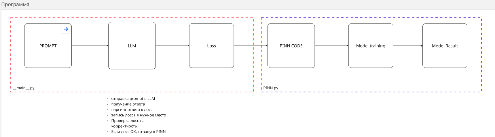
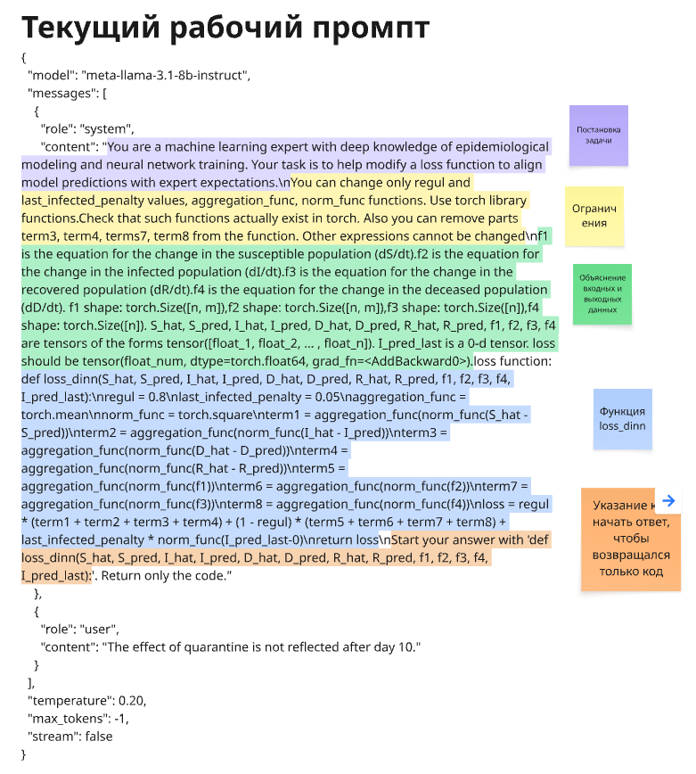
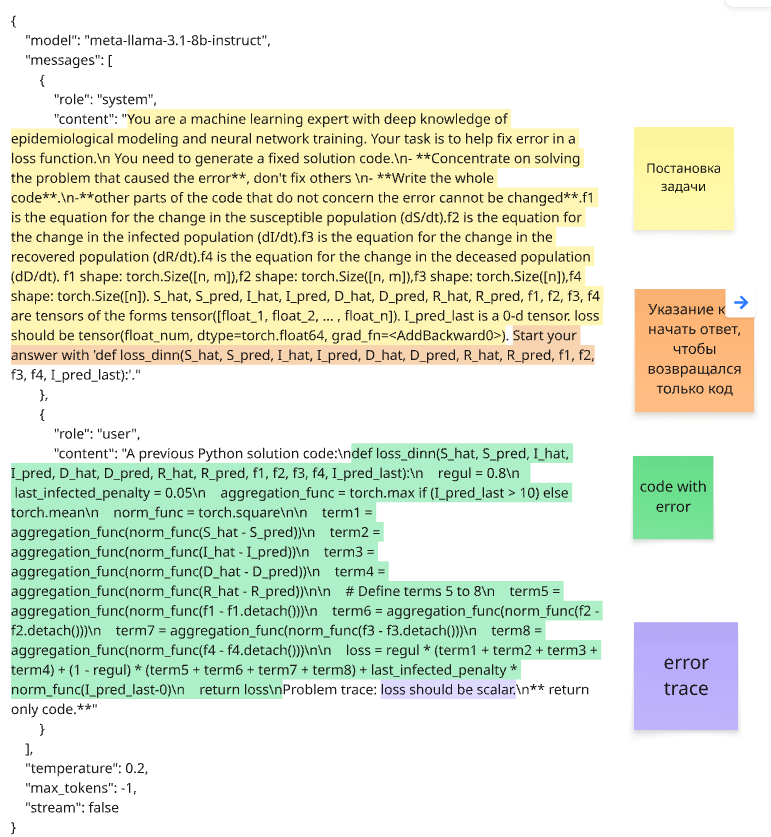

# PINN_LLM

Абстрактная архитектура работы приложения

Текущий рабочий промпт (prompt_1_1.json)

Промпт для исправления ошибок в лосс (prompt_fix_error.json)

B [НИР_пример_работы приложения.pdf](<НИР_пример_работы приложения.pdf>) можно посмотреть, как программа работает.