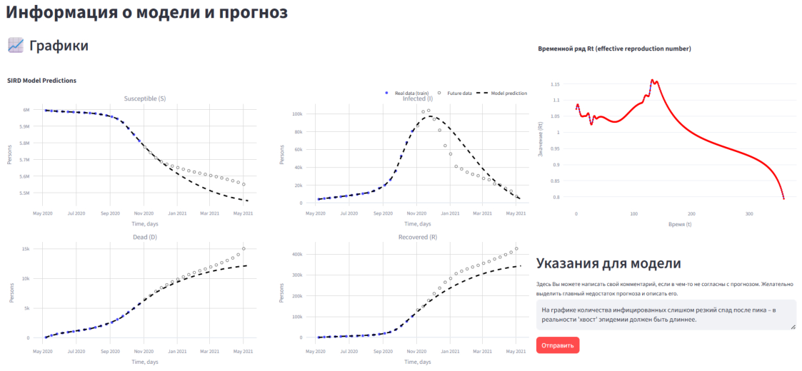
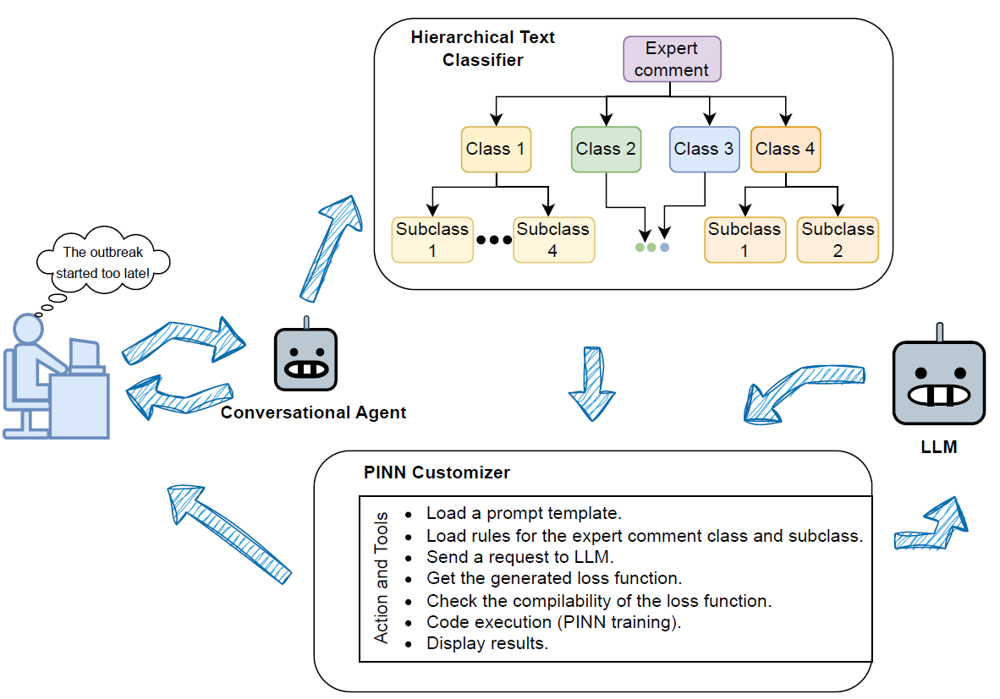
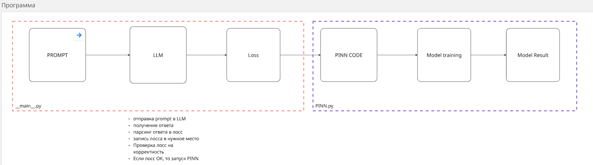
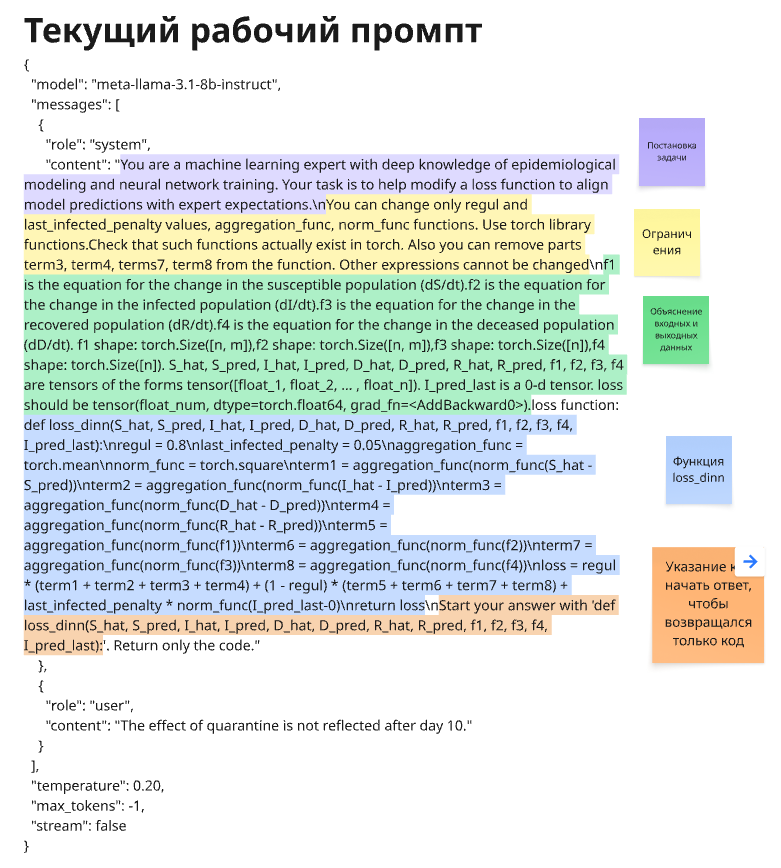
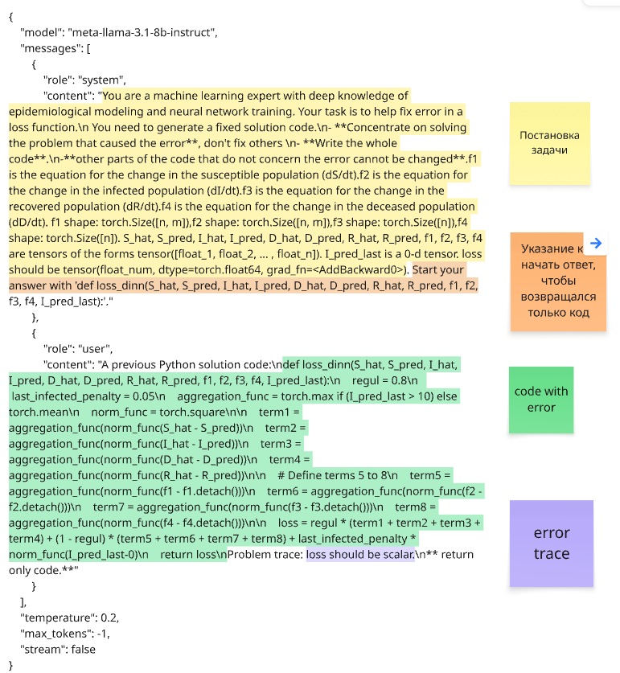

# Expert-Guided PINN Framework
## 🧠 О проекте
Expert-Guided PINN — это система для интерактивного прогнозирования эпидемиологических кривых, которая позволяет эпидемиологам корректировать прогнозы с помощью простых текстовых комментариев, без необходимости глубокого понимания математической модели.



## 🎯 Цель
Преодолеть разрыв между качественными экспертными знаниями (выраженными на естественном языке) и формальными математическими моделями. Система автоматически преобразует текстовые комментарии экспертов в модификации функции потерь физически информированной нейронной сети (PINN), делая процесс калибровки прогнозов доступным и динамическим.

## 🔧 Ключевые возможности
📝 Текстовая обратная связь — Эксперт пишет комментарий на естественном языке

🧩 Автоматическая классификация — BERT-модель определяет класс и подкласс комментария

🤖 Генерация кода LLM — Языковая модель преобразует комментарий в модификации функции потерь

📊 Динамическая адаптация PINN — Модель переобучается с учетом экспертной правки

🔄 Интерактивный цикл — Эксперт видит результат и может уточнить комментарий

Схема приложения:


## Установка зависимостей

Для CPU версии:
```bash
pip install -r requirements.txt
```
## Запуск 
```bash
streamlit run streamlit_main.py
```

requirements_cpu_or_gpu.txt - альтернативные зависимости для GPU

<!-- Абстрактная архитектура работы приложения



Текущий рабочий промпт (prompt_1_1.json)


Промпт для исправления ошибок в лосс (prompt_fix_error.json)



B [НИР_пример_работы приложения.pdf](<НИР_пример_работы приложения.pdf>) можно посмотреть, как программа работает. -->